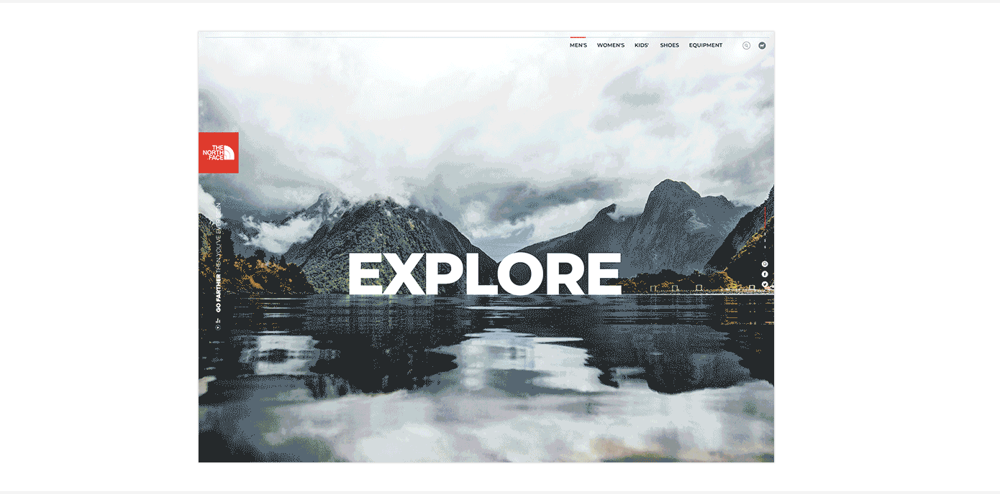
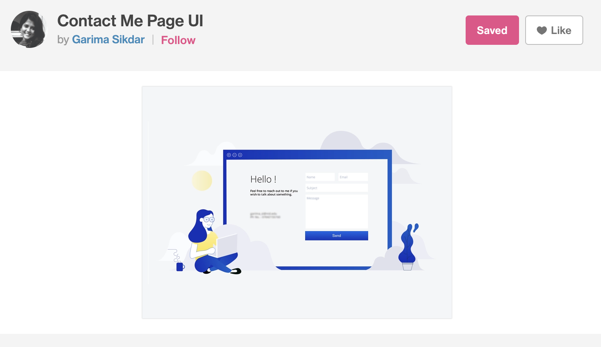

# Portfolio
By Michelle Wong

This Readme will include the following: 
* Link to my published portfolio website
* Link to my GitHub repository
* Description of my portfolio website

## Link to my portfolio website on netlify

[Michelle's Portfolio Website](https://themishmash.netlify.com/)

## Link to my GitHub repository

[Michelle's Portfolio on GitHub](https://github.com/themishmash/portfolio)

[Michelle's GitHub](https://github.com/themishmash)

## Description of my portfolio website
### Purpose 
The purpose of this website is to convey my skills as a developer and my skills as a hardworking individual to prospective employers. This online portfolio showcases my strengths, interests, professional knowledge and some projects I have bene working on. 

I wanted to create a simple, minimalist and elegant design for my website. I used Dribble (see below for more specific examples) to help in this process and coolors. In terms of colours, I wanted something that was mostly neutral and pastel that wouldn’t take away from the content or background images. I found the navy/dark blue, white and tan colours worked really well. 

Dribble

Coolors

### Functionality / Features
My portfolio has five main pages and each page contains a nav bar and footer. The nav bar has links to the other pages in the porfolio (see below for detail on the pages) and the footer contains links to GitHub and LinkedIn.

#### Home page
This is the landing page. It has a hero text box with buttons linking to the about me page and contact me page. It was made using flex. 

Home page Dribble inspiration

I loved how the North Face and REI had a beautiful landscape image and a hero text box. It was a minimalistic and simple but elegant design. I wanted to recreate something similar, as this really resonated with my love for the outdoors, hiking and a sense of adventure. 

North Face website inspiration from Dribble

REI website inspiration from Dribble

Figma Wireframe

#### About me page
This page was made using grid. It has one section with text, background colour and a photo. There is also a button with a link to my CV.

Inspiration from Dribble

Figma Wireframe

#### Portfolio page
This page was made using flex. It has three cards displaying my work, with button links to respective works. The cards are also animated. 

Figma Wireframe

#### Blog page
This page was made using flex. There are five blog posts, each with images and text.

Blog page

Inspiration from Dribble

Figma Wireframe

#### Contact page
This page was made using flex and forms. There are three input areas. 

Inspiration from Dribble

Figma Wireframe

### Sitemap

### Screenshots of responsiveness of my portfolio website

Tablet responsive

Phone responsive

### Screenshot of color-change branch

### Screenshot of font-change branch

### Screenshots to show changes made to portfolio page
Originally the buttons were inside the card like this. 

However, after I added the animation element to the cards, I thought it looked better to keep them out (see the screenshot above). 

Screenshot of the card flip for the portfolio page

### Screenshot after implementing Subresource Integrity (SRI) in a HTML document

### Target audience
The target audience for this website are prospective employers looking to hire a developer or IT professional. The employer is expected to have an understanding of information technology, software development, programming languages and programming stacks. The future employer is also expected to be looking for employees with a good work ethic, the ability to work in teams, a real desire for learning (especially as programming languages are constantly evolving) and professionalism.

### Tech stack
The tech stack used to develop this website was HTML and CSS. 

The source files were pushed to GitHub. 

Netlify was used as the deployment platform to publish my website.

